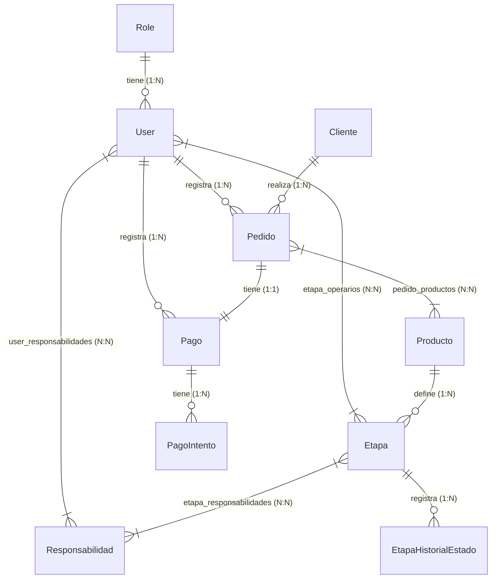

# Esquema y Relaciones de la Base de Datos - Sistema Fábrica

Este documento describe detalladamente la estructura de base de datos actual del sistema de fábrica, detallando las tablas, columnas, tipos de datos, restricciones y relaciones.

## Diagrama de Entidad-Relación (ERD)

---

## 1. Módulo de Usuarios, Roles y Competencias

### Tabla: `roles`
Define los roles del sistema para el control de acceso.

| Campo | Tipo | Restricción | Descripción |
| :--- | :--- | :--- | :--- |
| `id` | `bigint unsigned` | PK, Auto Increment | Identificador único del rol. |
| `name` | `varchar(255)` | Not Null | Nombre del rol (ej. "Administrador"). |
| `slug` | `varchar(255)` | Not Null, Unique | Identificador textual corto (ej. "admin"). |
| `created_at` | `timestamp` | Nullable | Fecha de creación del registro. |
| `updated_at` | `timestamp` | Nullable | Fecha de última actualización del registro. |

### Tabla: `users`
Almacena los datos de los usuarios, incluyendo administradores, supervisores y operarios.

| Campo | Tipo | Restricción | Descripción |
| :--- | :--- | :--- | :--- |
| `id` | `bigint unsigned` | PK, Auto Increment | Identificador único del usuario. |
| `name` | `varchar(255)` | Not Null | Nombre completo del usuario. |
| `email` | `varchar(255)` | Not Null, Unique | Correo electrónico de acceso. |
| `password` | `varchar(255)` | Not Null | Contraseña encriptada. |
| `role_id` | `bigint unsigned` | FK -> `roles.id` | Rol asignado. Restrict en borrado. |
| `created_at` | `timestamp` | Nullable | Fecha de creación del registro. |
| `updated_at` | `timestamp` | Nullable | Fecha de última actualización. |
| `deleted_at` | `timestamp` | Nullable | Fecha de borrado lógico (SoftDelete). |

### Tabla: `responsabilidades`
Almacena las competencias técnicas o habilidades requeridas por la fábrica.

| Campo | Tipo | Restricción | Descripción |
| :--- | :--- | :--- | :--- |
| `id` | `bigint unsigned` | PK, Auto Increment | Identificador único de la habilidad. |
| `nombre` | `varchar(255)` | Not Null | Nombre de la habilidad (ej. "Soldador"). |
| `descripcion` | `text` | Nullable | Descripción opcional de la competencia. |
| `created_at` | `timestamp` | Nullable | Fecha de creación del registro. |
| `updated_at` | `timestamp` | Nullable | Fecha de última actualización. |

### Tabla: `user_responsabilidades`
Relaciona a los usuarios/operarios con las competencias que poseen.

| Campo | Tipo | Restricción | Descripción |
| :--- | :--- | :--- | :--- |
| `id` | `bigint unsigned` | PK, Auto Increment | Identificador único del registro pivote. |
| `user_id` | `bigint unsigned` | FK -> `users.id` | Usuario titular. Cascade en borrado. |
| `responsabilidad_id`| `bigint unsigned` | FK -> `responsabilidades.id` | Competencia asociada. Cascade. |
| `created_at` | `timestamp` | Nullable | Fecha de asignación. |
| `updated_at` | `timestamp` | Nullable | Última modificación de la asignación. |

---

## 2. Módulo de Clientes, Pedidos y Productos

### Tabla: `clientes`
Información de contacto de empresas y clientes individuales.

| Campo | Tipo | Restricción | Descripción |
| :--- | :--- | :--- | :--- |
| `id` | `bigint unsigned` | PK, Auto Increment | Identificador único del cliente. |
| `nombre_cliente` | `varchar(255)` | Not Null | Nombre completo del contacto. |
| `nombre_empresa` | `varchar(255)` | Not Null | Nombre de la compañía o razón social. |
| `telefono` | `varchar(255)` | Not Null | Teléfono principal. |
| `email` | `varchar(255)` | Nullable | Correo electrónico del cliente. |
| `created_at` | `timestamp` | Nullable | Fecha de alta. |
| `updated_at` | `timestamp` | Nullable | Fecha de última actualización de datos. |
| `deleted_at` | `timestamp` | Nullable | Borrado lógico (SoftDelete). |

### Tabla: `pedidos`
Órdenes de fabricación recibidas.

| Campo | Tipo | Restricción | Descripción |
| :--- | :--- | :--- | :--- |
| `id` | `bigint unsigned` | PK, Auto Increment | Identificador del pedido. |
| `cliente_id` | `bigint unsigned` | FK -> `clientes.id` | Cliente titular. Restrict en borrado. |
| `user_id` | `bigint unsigned` | FK -> `users.id` | Usuario del sistema que registró el pedido. |
| `codigo` | `varchar(255)` | Not Null, Unique | Código único del pedido (ej. "PED-A12B"). |
| `estado` | `varchar(255)` | Default: `'pendiente'` | Estado del pedido (`pendiente`, `en_progreso`, `completado`, `cancelado`). |
| `prioridad` | `varchar(255)` | Default: `'normal'` | Prioridad (`baja`, `normal`, `alta`, `critica`). |
| `fecha_entrega` | `date` | Nullable | Fecha planificada de entrega. |
| `dias_vencimiento` | `integer` | Nullable | Plazo de vencimiento en días. |
| `observaciones` | `text` | Nullable | Notas adicionales. |
| `created_at` | `timestamp` | Nullable | Fecha de creación. |
| `updated_at` | `timestamp` | Nullable | Fecha de modificación. |
| `deleted_at` | `timestamp` | Nullable | Borrado lógico (SoftDelete). |

### Tabla: `productos`
Artículos predefinidos disponibles para fabricación.

| Campo | Tipo | Restricción | Descripción |
| :--- | :--- | :--- | :--- |
| `id` | `bigint unsigned` | PK, Auto Increment | Identificador único del producto. |
| `nombre` | `varchar(255)` | Not Null | Nombre del producto. |
| `sku` | `varchar(255)` | Nullable | Código de inventario (SKU). |
| `descripcion` | `text` | Nullable | Descripción o ficha técnica del producto. |
| `created_at` | `timestamp` | Nullable | Fecha de alta. |
| `updated_at` | `timestamp` | Nullable | Fecha de modificación. |

### Tabla: `pedido_productos`
Detalle de artículos y cantidades que componen cada pedido.

| Campo | Tipo | Restricción | Descripción |
| :--- | :--- | :--- | :--- |
| `id` | `bigint unsigned` | PK, Auto Increment | Identificador del registro. |
| `pedido_id` | `bigint unsigned` | FK -> `pedidos.id` | Pedido contenedor. Cascade en borrado. |
| `producto_id` | `bigint unsigned` | FK -> `productos.id` | Producto a fabricar. Cascade. |
| `cantidad` | `unsigned int` | Default: `1` | Cantidad de unidades requeridas. |
| `created_at` | `timestamp` | Nullable | Fecha de asociación. |
| `updated_at` | `timestamp` | Nullable | Fecha de modificación de la asociación. |

---

## 3. Módulo de Cobros y Pagos

### Tabla: `pagos`
Registra el cobro único asociado a un pedido.

| Campo | Tipo | Restricción | Descripción |
| :--- | :--- | :--- | :--- |
| `id` | `bigint unsigned` | PK, Auto Increment | Identificador del pago. |
| `pedido_id` | `bigint unsigned` | FK -> `pedidos.id`, Unique | Pedido liquidado. Restrict en borrado. |
| `registrado_por` | `bigint unsigned` | FK -> `users.id` | Usuario que cobró y registró el pago. |
| `medio` | `varchar(255)` | Not Null | Método de pago (ej. `'transferencia'`). |
| `estado` | `varchar(255)` | Default: `'pendiente'` | Estado financiero (`'pendiente'`, `'pagado'`). |
| `monto` | `decimal(12,2)` | Not Null | Monto de la operación en pesos. |
| `moneda` | `varchar(3)` | Default: `'ARS'` | Moneda utilizada. |
| `referencia_externa`| `varchar(255)`| Nullable | Identificador o número de transferencia. |
| `comprobante_url` | `varchar(255)` | Nullable | Enlace al archivo o captura del recibo. |
| `pagado_at` | `timestamp` | Nullable | Fecha y hora exacta de la confirmación del cobro. |
| `created_at` | `timestamp` | Nullable | Fecha de registro del pago en el sistema. |
| `updated_at` | `timestamp` | Nullable | Fecha de modificación. |

### Tabla: `pago_intentos`
Registro de intentos de cobro electrónicos para control de auditoría.

| Campo | Tipo | Restricción | Descripción |
| :--- | :--- | :--- | :--- |
| `id` | `bigint unsigned` | PK, Auto Increment | Identificador único del intento. |
| `pago_id` | `bigint unsigned` | FK -> `pagos.id` | Pago padre. Cascade en borrado. |
| `medio` | `varchar(255)` | Not Null | Canal de pago. |
| `estado` | `varchar(255)` | Not Null | Estado del intento (ej. `'exitoso'`, `'fallido'`). |
| `error_codigo` | `varchar(255)` | Nullable | Código de error devuelto por la pasarela. |
| `error_mensaje` | `text` | Nullable | Detalle del error devuelto. |
| `referencia_gateway`| `varchar(255)`| Nullable | ID devuelto por la API del gateway externo. |
| `created_at` | `timestamp` | Nullable | Fecha y hora del intento. |

---

## 4. Módulo de Fabricación y Etapas

### Tabla: `etapas`
Etapas ordenadas secuencialmente que componen la fabricación de un producto.

| Campo | Tipo | Restricción | Descripción |
| :--- | :--- | :--- | :--- |
| `id` | `bigint unsigned` | PK, Auto Increment | Identificador único de la etapa. |
| `producto_id` | `bigint unsigned` | FK -> `productos.id` | Producto al que pertenece. Cascade. |
| `nombre` | `varchar(255)` | Not Null | Nombre de la etapa (ej. "Encolado"). |
| `posicion` | `unsigned smallint`| Default: `0` | Orden cronológico de la etapa (ej. 1, 2, 3). |
| `estado` | `varchar(255)` | Default: `'pendiente'` | Estado de la etapa de fabricación. |
| `fecha_inicio` | `date` | Nullable | Fecha real de inicio. |
| `fecha_fin` | `date` | Nullable | Fecha real de finalización. |
| `created_at` | `timestamp` | Nullable | Fecha de alta. |
| `updated_at` | `timestamp` | Nullable | Última actualización. |

### Tabla: `etapa_operarios`
Asignación de operarios específicos para trabajar en una etapa del producto.

| Campo | Tipo | Restricción | Descripción |
| :--- | :--- | :--- | :--- |
| `id` | `bigint unsigned` | PK, Auto Increment | Identificador único. |
| `etapa_id` | `bigint unsigned` | FK -> `etapas.id` | Etapa a realizar. Cascade. |
| `user_id` | `bigint unsigned` | FK -> `users.id` | Operario asignado. Restrict en borrado. |
| `asignado_at` | `timestamp` | Default: `CURRENT_TIMESTAMP`| Fecha y hora de asignación. |

### Tabla: `etapa_responsabilidades`
Habilidades obligatorias que debe poseer el operario para poder participar en esta etapa.

| Campo | Tipo | Restricción | Descripción |
| :--- | :--- | :--- | :--- |
| `id` | `bigint unsigned` | PK, Auto Increment | Identificador único. |
| `etapa_id` | `bigint unsigned` | FK -> `etapas.id` | Etapa involucrada. Cascade. |
| `responsabilidad_id`| `bigint unsigned` | FK -> `responsabilidades.id` | Competencia requerida. Cascade. |
